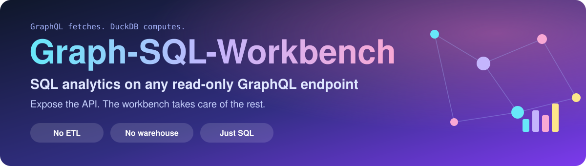
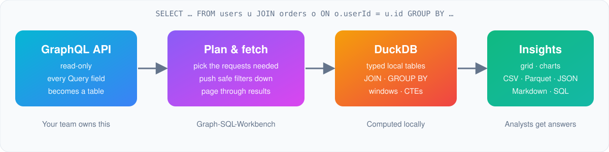
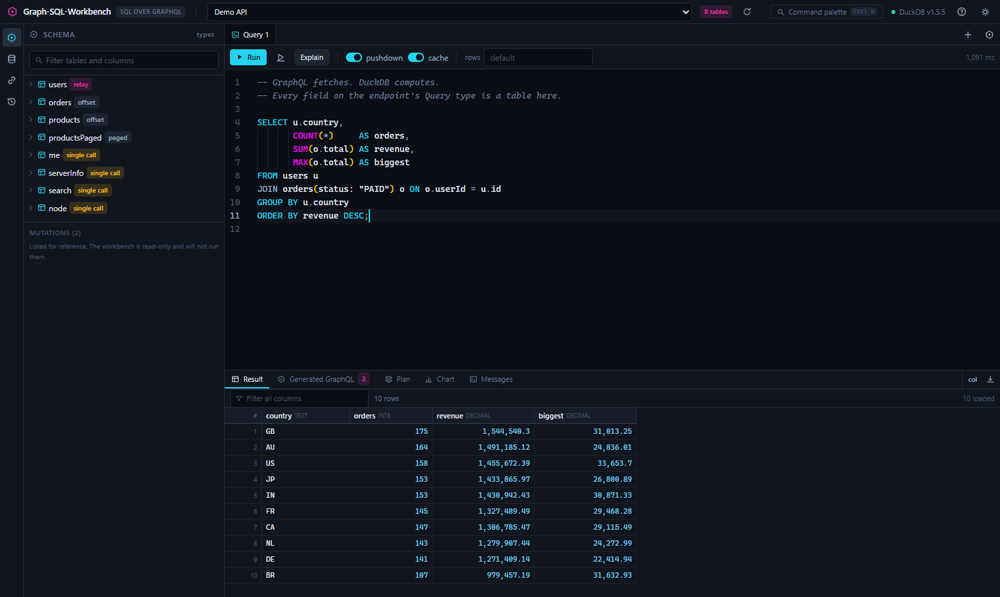
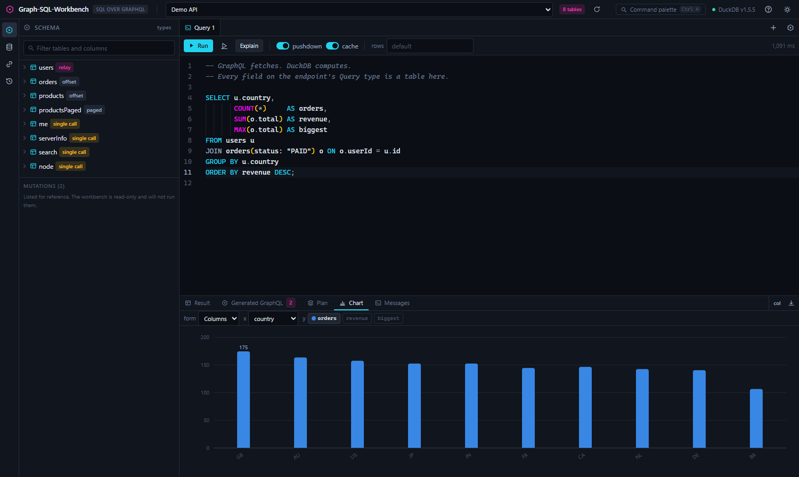
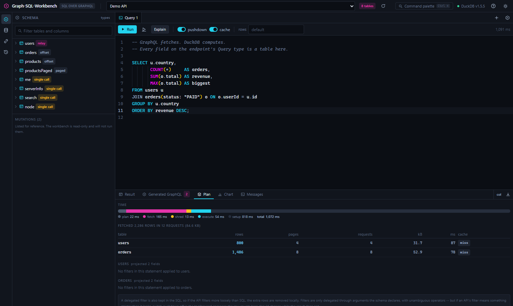

<p align="center">
  
</p>

<p align="center">
  
  
  
  
  
</p>

<p align="center">
  <b>No ETL.</b> &nbsp;·&nbsp; <b>No warehouse.</b> &nbsp;·&nbsp; <b>Just SQL.</b>
</p>

Your team already has the data behind a GraphQL API. Analysts want to `JOIN` it, `GROUP BY` it and
rank it, and GraphQL can't do any of that. The usual fix is a pipeline: an ETL job, a warehouse, a
dashboard tool, and someone to maintain all three.

Graph-SQL-Workbench removes the pipeline. **Expose a read-only GraphQL endpoint. The workbench
takes care of the rest.**

> **GraphQL fetches. DuckDB computes.**

## ✨ Why teams use it

- **No ETL, no warehouse.** Every field on the `Query` type becomes a table the moment you connect.
  There is nothing to model, sync or schedule.
- **Analysts get real SQL.** Joins across root fields (even where the schema models no
  relationship), `GROUP BY`, `SUM`, `MAX`, window functions like `RANK()`, CTEs, `PIVOT`. The
  dialect is DuckDB SQL, which is close to PostgreSQL.
- **Engineers keep control.** The only thing a team has to provide is a read-only GraphQL API,
  which they own, secure and rate-limit as they already do. The workbench never sends mutations:
  they are refused. Filters are sent to the endpoint only when the schema declares a matching
  argument, so the API isn't asked for more than it needs.
- **Fast iteration.** Results come back in a grid you can sort and filter over the whole result,
  chart in one click, and export to CSV, JSON, Parquet, Markdown or SQL INSERTs.
- **Honest about what it did.** The **Plan** tab shows the exact GraphQL that was sent, which
  filters went to the endpoint and which stayed local, how many rows and pages were fetched, and
  whether the row budget cut anything short.

## 🔄 How it works

<p align="center">
  
</p>

Point it at an endpoint and write SQL. The workbench:

1. works out which GraphQL requests it needs,
2. sends the filters the endpoint supports as arguments,
3. pages through the results,
4. loads the JSON into typed DuckDB tables,
5. runs your full SQL locally.

```sql
SELECT u.country,
       COUNT(*)     AS orders,
       SUM(o.total) AS revenue,
       MAX(o.total) AS biggest
FROM users u
JOIN orders(status: "PAID") o ON o.userId = u.id
GROUP BY u.country
ORDER BY revenue DESC;
```

Neither `users` nor `orders` knows about the other. The join is yours.

## 📸 See it

**Real SQL, real results.** Joins, aggregates and ordering over a GraphQL API, in a grid you can sort and filter:

<p align="center">
  
</p>

**One click to a chart.** The workbench suggests a form from the shape of the result:

<p align="center">
  
</p>

**Nothing hidden.** The Plan tab shows what was fetched, how long each step took, and which filters were sent:

<p align="center">
  
</p>

## 🚀 What a team needs to do

1. **Expose a read-only GraphQL endpoint** over the data you want analysed. A dedicated read-only
   role, a replica, or a schema that contains only `Query` is ideal. Introspection should be on;
   if it isn't, you can paste the SDL instead.
2. **Give analysts a token** (bearer, custom header or basic auth) scoped to that endpoint.
3. **They add a connection** in the workbench and start writing SQL.

That's the whole setup. There are no tables to create and no jobs to keep running. Today the
workbench runs on each analyst's machine; connections are plain JSON, so a team can share the
non-secret part (`workspace.json`) and keep tokens local.

## ⚡ Quick start

Requires Node 20.11 or newer.

```bash
npm install
npm start          # builds the UI, then serves the app and a demo API
```

Open **http://localhost:5470**. On first launch, add a connection (the form is pre-filled with
the bundled demo API at `http://127.0.0.1:5471/graphql`), then press **Ctrl+Enter**.

For development with hot reload:

```bash
npm run dev        # demo API :5471, workbench API :5470, Vite UI :5173
```

## What you can write

The dialect is **DuckDB SQL**, which is close to PostgreSQL. Window functions, CTEs, `QUALIFY`,
`PIVOT`, `UNNEST` and `GROUP BY ALL` all work. Common MySQL functions (`IFNULL`, `DATE_FORMAT`,
`CHAR_LENGTH`, `STR_TO_DATE` …) are provided as macros.

On top of that, the workbench adds:

| Syntax | What it does |
| --- | --- |
| `FROM users(first: 500, role: ADMIN)` | GraphQL arguments, written as the endpoint documents them. `first:` / `limit:` also cap how many rows are fetched. |
| `JOIN orders o ON o.userId = u.id` | Join anything to anything, whether or not the schema models the relationship. |
| `JOIN orders__items i ON i._parent_rowid = o._rowid` | A list of objects inside a row becomes its own child table. |
| `FROM users(@maxRows: 50000, @pageSize: 500)` | Engine options: `@maxRows`, `@pageSize`, `@allPages`, `@cache`, `@depth`. |
| `SELECT _raw FROM users` | Every row as the endpoint returned it. This is the escape hatch for anything that couldn't be flattened. |
| `SHOW TABLES` / `DESCRIBE users` / `SHOW SETTINGS` | Read the catalog: GraphQL and DuckDB types side by side. |
| `SET pushdown = off` / `SET max_rows = 50000` | Change settings for the rest of the session. |
| `MATERIALIZE users(first: 5000) AS snap` | Save a fetch as a real table that still works when the endpoint is offline. Also `REFRESH snap`, `DROP SNAPSHOT snap`, `SHOW SNAPSHOTS`. |

Press **F1** in the app for the full cheat sheet.

## The workbench

- **Schema tree.** Tables, flattened columns, types, arguments and pagination style. Click a column
  to insert it. The ▷ button next to a table runs `SELECT * … LIMIT 100`.
- **Editor.** Completion comes from the connected schema and understands aliases (after `u.` it
  offers that table's columns; inside `users(` it offers that field's GraphQL arguments). Hovering
  shows docs, and unknown tables get a warning squiggle.
  - **Ctrl+Enter** runs the whole script.
  - **Ctrl+Shift+Enter** runs only the statement under the cursor.
- **Result grid.** Rows and columns are virtualised, so large results scroll smoothly. NULLs are
  styled distinctly, numbers are right-aligned, and JSON cells can be expanded.
  - Sorting and filtering run in DuckDB over the **whole** result, not just the loaded page.
  - You can resize and pin columns, and select a range to copy it as TSV.
  - Export to CSV, JSON, Parquet, Markdown or SQL INSERTs.
- **Generated GraphQL.** The exact documents and variables that were sent. You can copy them or
  open them in a GraphQL tab.
- **Plan.** Shows:
  - which filters were sent to the endpoint and which stayed local (with the reason for each),
  - rows, pages, requests, bytes, and whether each fetch was a cache hit,
  - a timing breakdown,
  - DuckDB's `EXPLAIN` output.
- **Chart.** Suggests a form from the result's shape: a line for time series, columns for
  categories, a scatter for two measures. The palette has been checked for colour-blind safety in
  both themes.
- **Relationships.** Lists joins guessed from column names (for example `orders.userId → users.id`)
  alongside the certain nested ones, and draws them as a diagram.
- **GraphQL tab.** Talks to the endpoint directly. It's read-only: mutations are refused.
- Also: a command palette (**Ctrl+K**), history, and dark and light themes.

## Filter pushdown, and why it's safe

A `WHERE` filter is sent as a GraphQL argument only when the schema actually has a matching
argument with a compatible type. Each connection has a pushdown profile:

| Profile | Filters it sends |
| --- | --- |
| `auto` (default) | Arguments with the column's exact name (equality), plus filter objects it can find in the schema, such as `filter: {code: {eq: …}}` or `where: {col: {_eq: …}}`. Only unambiguous operators: `eq`, `ne`, `gt`, `gte`, `lt`, `lte`, `in`, `nin`, is-null. |
| `hasura` | `where: {col: {_eq: …}}`, including `_like` |
| `strapi` | Strapi's filter format |
| `flat` | Arguments named like `col_gt` |
| `none` | Nothing. All filtering happens locally. |

**How safe is it?** A filter that's sent to the endpoint is also kept in the SQL, so if the API
filters more loosely than SQL would (for example, ignoring case), the extra rows are removed
locally. The reverse isn't covered: if an API's filter is stricter than it looks, those rows never
arrive. That's why the workbench only sends filters to arguments the schema declares, with a matching
type, and never sends operators such as `contains` or `regex` whose meaning varies between APIs. The
**Plan** tab lists every filter that was sent. If a result looks wrong, turn pushdown off in the
toolbar and compare: the rows fetched should change, and the result should not.

`LIMIT` is sent to the endpoint only when that can't change the answer: a single table, no joins,
aggregates, `DISTINCT` or `ORDER BY`, and every `WHERE` filter already sent.

## Architecture

```
Browser (React 19) --SSE--> Fastify server --HTTP--> GraphQL endpoint
                             pre-pass -> analyse -> plan -> fetch/paginate -> shred -> DuckDB
```

| Package | Role |
| --- | --- |
| `packages/shared` | Types shared by the server and the UI |
| `packages/server` | Catalog, planner, pushdown, fetcher, cache, DuckDB engine, HTTP API |
| `packages/web` | The UI (Monaco editor, virtualised grid, charts, ER diagram) |
| `packages/demo-api` | A local GraphQL endpoint that covers Relay, offset, page-based and Hasura-style APIs |

There are two reasons it runs a server instead of being browser-only:

- Browsers can't POST to arbitrary third-party endpoints because of CORS.
- Native DuckDB gives real memory limits, can spill to disk, and writes Parquet.

## Connections

A connection has:

- an endpoint and authentication (bearer token, custom header, or basic auth),
- extra headers (`${env:VAR}` is replaced with an environment variable),
- a pushdown profile,
- column depth, page size, row budget, concurrency, requests per second, timeout and cache lifetime,
- custom scalar types (for example `{"Money": "DECIMAL(38,9)"}`),
- optionally, pasted **SDL** for endpoints that have introspection disabled.

Tokens are kept in a separate `secrets.json`, so `workspace.json` holds no secrets and can be
shared.

Local state lives in `%APPDATA%\graphql-workbench` on Windows,
`~/Library/Application Support/graphql-workbench` on macOS, or `$XDG_DATA_HOME/graphql-workbench`
on Linux. Set `GQLWB_DATA_DIR` to use a different folder. Only one running instance can open that
folder's database at a time.

## Tests

```bash
npm test           # 216 unit + integration tests (catalog, pre-pass, pushdown, fetcher, full pipeline)
npm run test:e2e   # 8 browser tests driving the real app (Playwright)
npm run typecheck
```

The end-to-end suite runs queries through the full stack against the demo API and compares the
results with totals computed independently in plain JavaScript from the same seed data.

For `test:e2e`, Playwright needs a Chromium build. Run `npx playwright install chromium` once. If
your browsers live elsewhere, set `PLAYWRIGHT_BROWSERS_PATH`.

## Developing

`CLAUDE.md` at the root and in each package explains the architecture, the invariants that must
not break, and the environment gotchas. Read them before changing the engine; they are also
loaded automatically by [Claude Code](https://claude.com/claude-code).

Scripts for working on the engine:

```bash
npx tsx scripts/run-sql.ts <endpoint> "<sql>"   # trace one statement: catalog, GraphQL sent, pushdown, fetch, result
npx tsx scripts/probe-apis.ts [name]            # run the engine against public APIs
node scripts/screenshots.mjs                    # screenshot every view in both themes (app must be running)
```

For Claude Code users, `.claude/` provides:

| Kind | Name | Use it to |
| --- | --- | --- |
| Skill | `verify-change` | Run the full check sequence before calling a change done |
| Skill | `onboard-graphql-api` | Diagnose and fix how a specific GraphQL API is handled |
| Skill | `add-pagination-style` | Support a new way APIs page through results |
| Skill | `add-pushdown-rule` | Change which filters are sent to the API, safely |
| Skill | `add-workbench-statement` | Add statements like `SHOW` / `MATERIALIZE`, or MySQL macros |
| Agent | `pushdown-safety-reviewer` | Review a diff for changes that could return wrong results silently |
| Agent | `graphql-api-prober` | Report how well the engine handles one or more endpoints |
| Agent | `ui-verifier` | Screenshot and review the UI in both themes |

## Tested against public APIs

`npx tsx scripts/probe-apis.ts [name]` runs the real engine against these endpoints (no auth needed).
Results from the last run:

| API | Style | Result |
| --- | --- | --- |
| [Countries](https://countries.trevorblades.com/) | plain lists, `filter: {code: {eq}}` | Works. 250 countries; nested `languages` join; `WHERE code = 'DE'` sent as a filter, fetching 1 row instead of 250. |
| [Rick and Morty](https://rickandmortyapi.com/graphql) | page numbers, `info { next }` | Works. All 826 characters across 42 pages. |
| [SWAPI](https://swapi-graphql.netlify.app/graphql) | Relay connections | Works. All 82 people over 2 pages; 6 films. |
| [PokeAPI](https://beta.pokeapi.co/graphql/v1beta) | Hasura, 459 root fields | Works. `where._gt` filters and `limit:` sent to the API. |
| [AniList](https://graphql.anilist.co) | one `Page` wrapper holding many lists | Only partly supported: the lists inside `Page(...)` aren't yet tables of their own. |
| SpaceX community API | offset | Its upstream (`api.spacexdata.com`) was returning HTML errors; the workbench reported the error correctly. |

## Limitations

- **Row budget.** Rows are fetched before they're computed over, so analysis is capped by the row
  budget (default 10,000 per table; you can raise it). When a fetch is cut short, the workbench
  always says so.
- **Pushdown needs matching arguments.** Filters only go to the endpoint when it has an argument
  for them. Otherwise everything is fetched and filtered locally.
- **Interfaces and unions.** Fields that exist only on one concrete type under an interface or
  union are reachable only through `_raw`.
- **`QUALIFY` + `GROUP BY ALL`.** DuckDB can't combine these. List the grouping columns explicitly.
- **Read-only.** Mutations are deliberately not supported.
